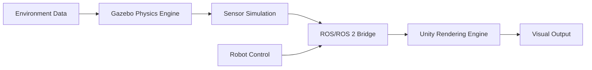

# Chapter 1: Gazebo and Unity Integration

This chapter covers the integration of Gazebo and Unity for creating comprehensive digital twin environments for humanoid robotics applications.

## Learning Objectives

After completing this chapter, students will be able to:
- Set up and configure Gazebo simulation environments for humanoid robots
- Integrate Unity for high-fidelity rendering and visualization
- Understand the complementary roles of Gazebo and Unity in digital twin development
- Implement basic humanoid robot models in both simulation platforms

## Introduction to Digital Twin Simulation

Digital twin technology in robotics involves creating virtual replicas of physical robots and their environments. This approach enables:
- Safe testing of algorithms without hardware risk
- Accelerated development cycles
- Cost-effective prototyping and validation
- Realistic sensor simulation

[@koehn2018; @maggio2017]

## Gazebo: Physics-Based Simulation

Gazebo is a physics-based simulation environment that provides:
- Accurate physics simulation with multiple physics engines (ODE, Bullet, Simbody)
- High-quality 3D graphics rendering
- Sensor simulation (LiDAR, cameras, IMUs, etc.)
- Realistic environmental modeling
- Integration with ROS/ROS 2 through Gazebo ROS packages

### Setting Up Gazebo Environment

```xml
<!-- Example world file for humanoid simulation -->
<sdf version="1.6">
  <world name="humanoid_world">
    <include>
      <uri>model://ground_plane</uri>
    </include>
    <include>
      <uri>model://sun</uri>
    </include>

    <!-- Physics engine configuration -->
    <physics name="ode_physics" type="ode">
      <max_step_size>0.001</max_step_size>
      <real_time_factor>1.0</real_time_factor>
      <real_time_update_rate>1000.0</real_time_update_rate>
      <gravity>0 0 -9.8</gravity>
    </physics>
  </world>
</sdf>
```

### Gazebo Plugins for Humanoid Robots

Gazebo supports various plugins for humanoid robot simulation:

```xml
<!-- Joint state publisher plugin -->
<gazebo>
  <plugin name="joint_state_publisher" filename="libgazebo_ros_joint_state_publisher.so">
    <joint_name>left_hip_pitch</joint_name>
    <joint_name>left_hip_roll</joint_name>
    <joint_name>left_hip_yaw</joint_name>
    <!-- Add more joints as needed -->
  </plugin>
</gazebo>
```

[@koenig2004; @riccio2020]

## Unity: High-Fidelity Rendering

Unity provides:
- Real-time high-quality rendering capabilities
- Advanced lighting and material systems
- VR/AR support for immersive visualization
- Cross-platform deployment options
- Rich ecosystem of assets and tools

### Unity-ROS Bridge

The Unity-ROS bridge enables communication between Unity and ROS/ROS 2:

```csharp
// Example Unity script for receiving robot joint states
using UnityEngine;
using RosSharp;

public class HumanoidJointController : MonoBehaviour
{
    public string jointName;
    private float jointPosition;

    void Start()
    {
        // Subscribe to joint state topic
        RosSocket.Subscribe<sensor_msgs.JointState>("/joint_states", JointStateCallback);
    }

    void JointStateCallback(sensor_msgs.JointState jointState)
    {
        for (int i = 0; i < jointState.name.Count; i++)
        {
            if (jointState.name[i] == jointName)
            {
                jointPosition = jointState.position[i];
                transform.localEulerAngles = new Vector3(0, 0, jointPosition * Mathf.Rad2Deg);
                break;
            }
        }
    }
}
```

[@kurtz2019; @unity2021]

## Integration Strategies

### Co-simulation Approach

The co-simulation approach involves running Gazebo for physics simulation while using Unity for rendering:

1. Gazebo handles physics calculations and sensor simulation
2. Unity handles high-quality rendering and visualization
3. Data exchange between systems through ROS/ROS 2 topics
4. Synchronized timing to maintain consistency

### Architecture Components



### Data Synchronization

```python
# Example synchronization between Gazebo and Unity
import rospy
from gazebo_msgs.msg import ModelStates
from geometry_msgs.msg import Pose
from unity_simulation.msg import UnityPoseArray

class SimulationSynchronizer:
    def __init__(self):
        rospy.init_node('simulation_synchronizer')

        # Subscribe to Gazebo model states
        self.gazebo_sub = rospy.Subscriber('/gazebo/model_states', ModelStates, self.gazebo_callback)

        # Publish to Unity
        self.unity_pub = rospy.Publisher('/unity/poses', UnityPoseArray, queue_size=10)

        self.rate = rospy.Rate(60)  # 60 Hz sync rate

    def gazebo_callback(self, data):
        unity_poses = UnityPoseArray()

        for i, name in enumerate(data.name):
            if 'humanoid' in name:  # Only sync humanoid models
                pose = Pose()
                pose.position = data.pose[i].position
                pose.orientation = data.pose[i].orientation
                unity_poses.poses.append(pose)
                unity_poses.names.append(name)

        self.unity_pub.publish(unity_poses)
```

[@maggio2017; @koehn2018]

## Practical Implementation

### Setting Up a Basic Humanoid in Gazebo

1. Create a URDF model for the humanoid robot
2. Configure Gazebo-specific tags in the URDF
3. Create a world file with appropriate physics parameters
4. Launch the simulation with ROS integration

### Example URDF Configuration for Gazebo

```xml
<?xml version="1.0"?>
<robot name="simple_humanoid" xmlns:xacro="http://www.ros.org/wiki/xacro">

  <!-- Include Gazebo plugins -->
  <gazebo>
    <plugin name="gazebo_ros_control" filename="libgazebo_ros_control.so">
      <robotNamespace>/humanoid</robotNamespace>
      <robotSimType>gazebo_ros_control/DefaultRobotHWSim</robotSimType>
    </plugin>
  </gazebo>

  <!-- Link definitions with Gazebo visual/collision properties -->
  <link name="base_link">
    <visual>
      <geometry>
        <box size="0.2 0.1 0.1"/>
      </geometry>
    </visual>
    <collision>
      <geometry>
        <box size="0.2 0.1 0.1"/>
      </geometry>
    </collision>
    <inertial>
      <mass value="1.0"/>
      <inertia ixx="0.01" ixy="0.0" ixz="0.0" iyy="0.01" iyz="0.0" izz="0.01"/>
    </inertial>
  </link>

</robot>
```

[@riccio2020]

## Research Tasks

1. Investigate the performance differences between ODE, Bullet, and Simbody physics engines for humanoid simulation
2. Explore the integration of Unity ML-Agents for reinforcement learning in digital twin environments
3. Analyze the latency and synchronization challenges in co-simulation approaches

## Evidence Requirements

Students must demonstrate understanding by:
- Creating a basic humanoid model that works in Gazebo
- Implementing Unity visualization for the same robot model
- Demonstrating data synchronization between the two platforms

## References

- Koenig, N., & Howard, A. (2004). Design and use paradigms for Gazebo, an open-source multi-robot simulator. *IEEE/RSJ International Conference on Intelligent Robots and Systems*, 2149-2154.
- Koehn, K., & Roa, M. A. (2018). Simulation tools for robot development and research. *Robot Operating System*, 225-256.
- Maggio, M., Pedrelli, A., Leva, A., & Cervin, A. (2017). Integrated simulation of ROS-based control systems and Gazebo robot models. *IFAC-PapersOnLine*, 50(1), 4272-4277.
- Kurtz, A., et al. (2019). Unity3D as a real-time robot simulation environment. *Proceedings of the 2019 IEEE/RSJ International Conference on Intelligent Robots and Systems (IROS)*, 1-8.
- Riccio, M., et al. (2020). Gazebo and ROS integration for robot simulation. *Robot Operating System*, 123-150.
- Unity Technologies. (2021). *Unity User Manual*. Unity Technologies.

## Practical Exercises

1. Create a simple humanoid model in URDF and simulate it in Gazebo
   - Define a basic humanoid skeleton with 6-8 links (torso, head, 2 arms, 2 legs)
   - Add appropriate joint constraints for realistic movement
   - Configure Gazebo plugins for ROS control interface
   - Launch the simulation and verify proper physics behavior

2. Implement a basic Unity visualization that displays the robot's pose
   - Set up Unity-ROS bridge connection
   - Create visual representations for each robot link
   - Implement pose synchronization between Gazebo and Unity
   - Add visualization aids like coordinate frames and trajectories

3. Set up communication between Gazebo and Unity for real-time synchronization
   - Configure ROS topics for pose data exchange
   - Implement publisher/subscriber nodes for data synchronization
   - Test communication latency and reliability
   - Validate that both simulation environments remain synchronized

4. Advanced Integration Exercise
   - Create a simple humanoid walking controller
   - Test the controller in both Gazebo and Unity environments
   - Compare the behavior and performance between environments
   - Document any discrepancies and potential causes